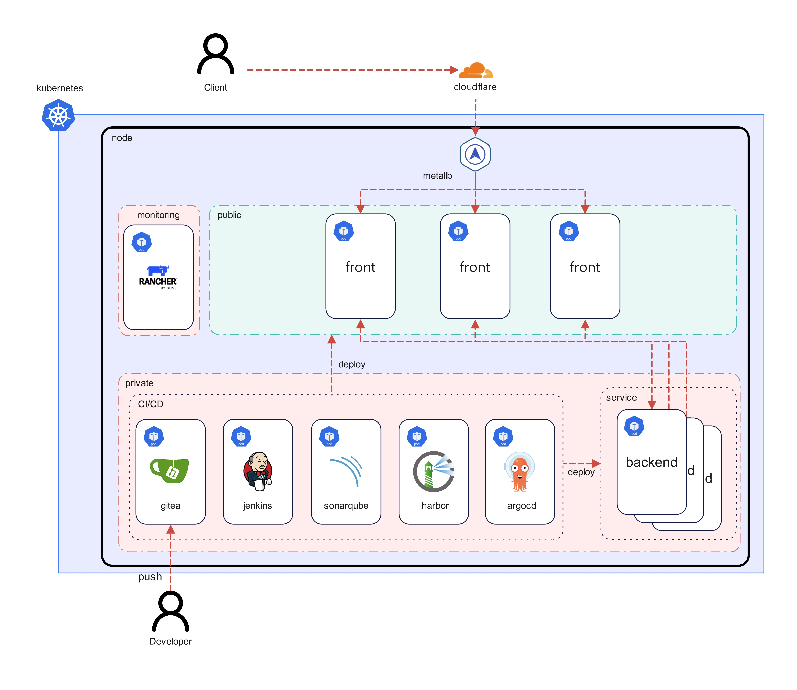
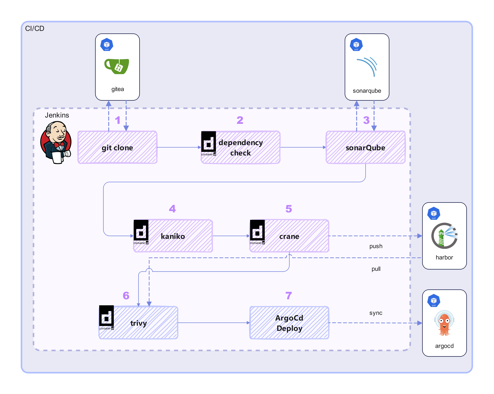
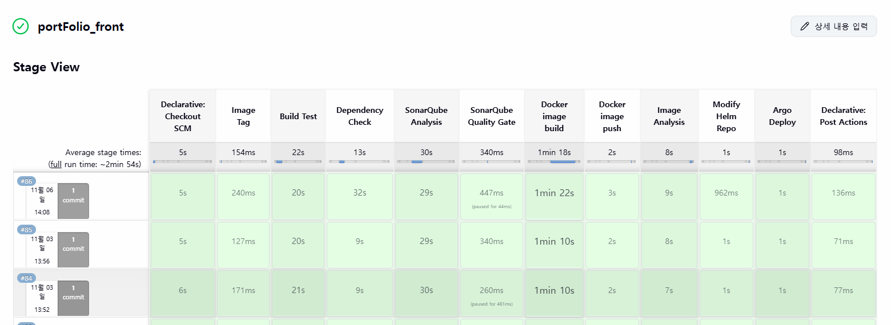
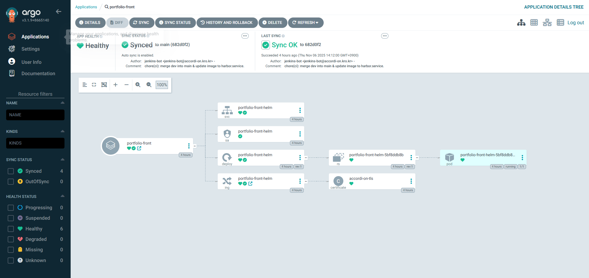
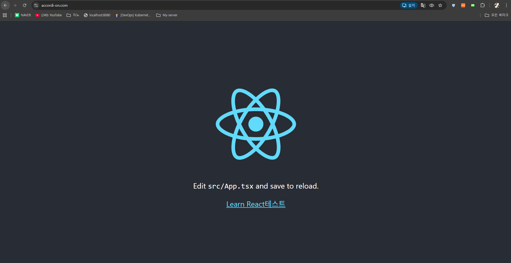

# 온프레미스 기반 DevSecOps CI/CD 인프라 구축

## 🔍 프로젝트 개요
클라우드 없이 온프레미스 자원 위에서 Kubernetes 기반의 DevSecOps CI/CD 파이프라인을 직접 설계·구축했습니다.  
Gitea → Jenkins → SonarQube → Harbor → ArgoCD로 이어지는 자동화 흐름을 구현하였으며, MetalLB·Ingress·Rancher를 활용하여 서비스 배포, 관리, 보안을 통합했습니다.

## 🛠 사용 기술
- Kubernetes, Docker  
- MetalLB (LoadBalancer)  
- Ingress Controller (NGINX)  
- Rancher (클러스터 관리)  
- Gitea (Git 저장소)  
- Jenkins (CI 파이프라인)  
- SonarQube, OWASP Dependency-Check, Trivy (코드·이미지 보안 검사)  
- Harbor (이미지 레지스트리)  
- ArgoCD (GitOps 배포)  
## 🏗 시스템 아키텍처(사진)



---



---
## 🏗 시스템 아키텍처  
```text
Gitea (SCM)
   ↓ Webhook
Jenkins (CI)
   ↓ Kaniko Build → Trivy Scan → SonarQube Test
Harbor (Registry)
   ↓
ArgoCD (CD)
   ↓
Kubernetes Cluster (Auto Deploy via Helm)
   ├─ MetalLB (LoadBalancer IP)  
   ├─ Ingress Controller (NGINX)  
   └─ Rancher (모니터링·관리)
```

## 🚀 실행 결과

### ✅ Jenkins Pipeline (CI)

> Gitea → Jenkins → SonarQube → Trivy → Harbor → ArgoCD  
> 코드 푸시부터 배포까지 약 **3분 이내**에 자동 처리되는 CI/CD 파이프라인.

---

### 🧩 ArgoCD (CD)

> Jenkins에서 Harbor로 이미지 푸시 후, ArgoCD가 Helm Chart를 통해  
> Kubernetes 클러스터에 자동 배포 및 Sync 완료.   
> 상태: **Healthy / Synced**

---

### 🌐 실제 서비스 배포 확인

> 도메인: **[accordi-on.com](https://accordi-on.com)**  
> React 프론트엔드가 정상적으로 배포되어 접속 가능한 상태.
